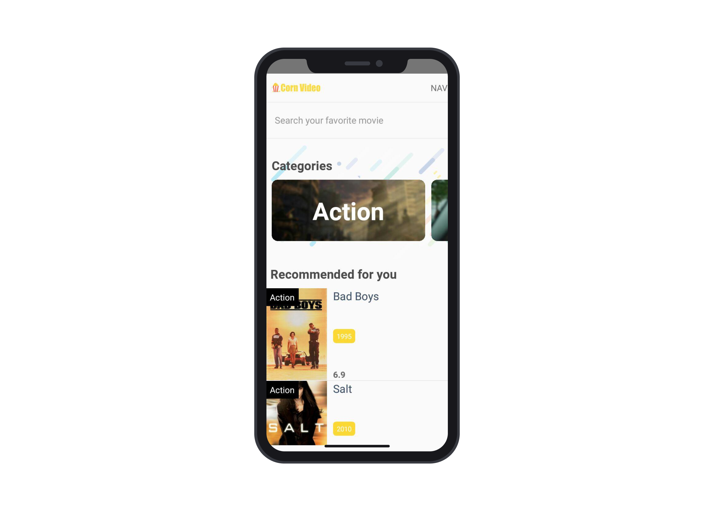

# :corn: Corn Video App 



Corn Video is an application that shows all the best movies using the [YTS](https://yts.lt/) API.

## Getting Started

These instructions will get you a copy of the project up and running on your local machine for development and testing purposes. See deployment for notes on how to deploy the project on a live system.

### Prerequisites

You need to have installed [Node.js](https://nodejs.org) and the [React Native CLI](https://facebook.github.io/react-native/docs/0.59/getting-started).

Then clone the repository writing the next line on your terminal.

```
git clone https://github.com/D4v1d98Ru1z/corn-video-app.git
```

### Installing

Move into the directory, install the dependencies of the project.
```
cd corn-video-app
npm i
```
Finally, you can test it on development running the followed commands from react-native-cli. 

```
# Run Android environment
react-native run-android

# Run iOS environment
react-native run-ios
```


## Built With

* [React Native](https://facebook.github.io/react-native) - Framework to build bridge apps
* [Redux](https://redux.js.org/) - State Management

## Contributing

Please feel free to send pull request if you want to contribute!

## Authors

* **David Ruiz** - *Development* - [David Ruiz](https://github.com/D4v1d98Ru1z)

## License

This project is licensed under the MIT License.
